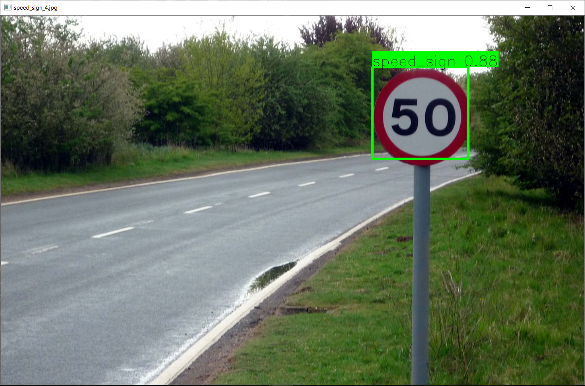

# Yolov3 Custom Object detection

----

* This project uses `tensorflow==1.14` & `keras==2.2.4`.

### Project Information

* This repository contains files necessary for building the custom object detector using YoloV3 using tensorflow and keras.
* The goal of the project was to build a cutom object detector that can detect:
  1. Traffic signs.
  2. Speed limit signs.
  3. Stop signs.
  4. Traffic Lights.
  5. Car.
  6. Bus.

* The dataset for `speed limit signs` dataset was created by manually scraped from the web and annotate using [labelIMg](https://github.com/tzutalin/labelImg) and converted to the format yolo desires.  The dataset for other images was pulled from the [Open Images Dataset](https://storage.googleapis.com/openimages/web/index.html).

### Credits
  
* Tutorials and codes used in this project comes from [pylessons.com](https://pylessons.com/YOLOv3-introduction/).
* Youtube channel playlist: [playlist](https://www.youtube.com/playlist?list=PLbMO9c_jUD45f2Hmka1h0l8JisyXUkHoC)
* New Tensorflow 2.x based YoloV3 playlist: [playlist](https://www.youtube.com/playlist?list=PLbMO9c_jUD473OgrKYYMLRMEz-XZjG--n)

### Instructions

1. Download the desired image datasets if available from OpenImagesDatasets following [this](https://pylessons.com/YOLOv3-custom-data/) tutorial and convert them to XML using the tutorial.
2. In case you've have your own dataset, annotate your custom dataset using [this](https://github.com/tzutalin/labelImg) tool and save the annotated files in the XML format in the save folder as the image.
3. Make sure each you want to detect has it's own seperate folder in which both the images and xml file reside.
4. When this is done as per the tutorial, run `voc_to_YOLOv3.py` to get the annotation file as required by YOLOv3.
5. Change the variable `dataset_file` in `voc_to_YOLOv3.py` as fit. I had 6 classes so changed it to `'6_CLASS_test.txt`.
6. From there just follow the tutorial series.
7. You can train the algorithm on colab, upload the .ipynb notebook uploaded.
8. I used google drive to download and run different scripts, you can find the files in the tutorials github account.
9. You might need to download `yolov3.weights` files and put it in the **model_data** folder before-hand.
dad

* **Sample Output**

#### Next Steps:
1. Train a tiny-yolo model for the dataset.
2. Try the new `YoloV4` model and train your custom object detector.
3. Try other new models in the `object detection` domain.

* **End notes**
* I cannot share the custom dataset file as of yet.
* I'll open the link for download in the upcoming month.